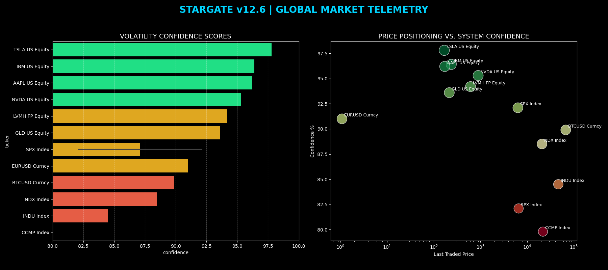

# 🌌 Stargate-Cluster v12.6 | Global Financial Telemetry

A high-performance, real-time market monitoring engine built for enterprise-grade volatility analysis. This system bridges **Bloomberg (blpapi)** telemetry with **PostgreSQL** persistence and **C++20** visualization.

## 📊 Performance Dashboard (v12.6 Live)


## 🏗️ Architecture Stack
- **Data Ingestion:** Python 3.10+ (Pandas, blpapi, psycopg2)
- **Database:** PostgreSQL (Optimized with Time-Series Indexing)
- **High-Performance Layer:** C++20 (SIMD/AVX2 optimized risk calculations)
- **Visualization:** ANSI 256-color Terminal Heatmaps & Matplotlib Dashboards

## 📂 Core Components
| Component | Language | Description |
| :--- | :--- | :--- |
| **stargate_heatmap.cpp** | C++ | Visual risk matrix using ANSI color-coding for rapid sentiment analysis. |
| **stargate_monitor.cpp** | C++ | Sub-millisecond risk reporter utilizing native PostgreSQL linking. |
| **stargate_dashboard.py** | Python | Generates high-fidelity PNG dashboards (Matplotlib/Seaborn) for executive review. |
| **stargate_v13_alpha.cpp**| C++ | Experimental branch for geopolitical stress detection (Iran War scenario). |
| **init_db.sql** | SQL | Database schema and initial volatility seeding for the `stargate_audit` DB. |

## 🛠️ Deployment Instructions

### 1. Initialize the Audit Layer
```bash
createdb stargate_audit
psql -d stargate_audit -f init_db.sql
2. Run the Visualization Engine
Bash

python stargate_dashboard.py

3. Launch the Live Pulse
Bash

watch -n 5 -c './stargate_heatmap'

Mission: EmploymentMission2026 | Senior Enterprise Architect Deployment.
Location: Rio de Janeiro / São Paulo, Brazil.
